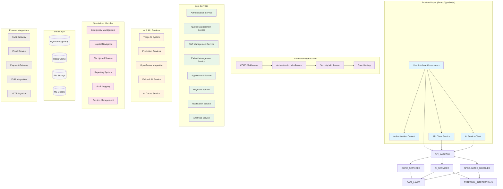

# Hospital Queue Management System - Module Overview

## System Architecture Diagram

## Module Descriptions

### Frontend Layer
- **User Interface Components**: React components for different user roles (Admin, Staff, Patient)
- **Authentication Context**: Manages user sessions and permissions
- **API Client Service**: Handles HTTP requests to backend APIs
- **AI Service Client**: Specialized client for AI-powered features

### API Gateway Layer
- **CORS Middleware**: Cross-origin resource sharing configuration
- **Authentication Middleware**: JWT token validation and user authentication
- **Security Middleware**: Input sanitization, XSS protection, security headers
- **Rate Limiting**: Prevents abuse and ensures fair resource usage

### Core Services
- **Authentication Service**: User registration, login, role management
- **Queue Management Service**: Patient queue operations, position tracking
- **Staff Management Service**: Staff scheduling, role assignments, performance tracking
- **Patient Management Service**: Patient records, history, demographics
- **Appointment Service**: Scheduling, booking, calendar management
- **Payment Service**: Billing, insurance processing, payment gateway integration
- **Notification Service**: SMS, email, in-app notifications
- **Analytics Service**: Dashboard metrics, reporting, insights

### AI & ML Services
- **Triage AI System**: Symptom analysis, emergency level assessment
- **Prediction Services**: Wait time prediction, peak hour forecasting
- **OpenRouter Integration**: External AI model access (DeepSeek, etc.)
- **Fallback AI Service**: Local AI processing when external services unavailable
- **AI Cache Service**: Response caching for improved performance

### Specialized Modules
- **Emergency Management**: Ambulance dispatch, critical care coordination
- **Hospital Navigation**: Indoor navigation, location services
- **File Upload System**: Document management, medical imaging
- **Reporting System**: Advanced analytics, custom reports
- **Audit Logging**: Security event tracking, compliance logging
- **Session Management**: User session tracking, timeout handling

### Data Layer
- **Database**: SQLite/PostgreSQL for structured data storage
- **Cache**: Redis for session storage and API response caching
- **File Storage**: Document and image storage system
- **ML Models**: Trained machine learning models for predictions

### External Integrations
- **SMS Gateway**: Infobip integration for SMS notifications
- **Email Service**: Email notifications and communications
- **Payment Gateway**: External payment processing
- **EHR Integration**: Electronic Health Record system integration
- **HL7 Integration**: Healthcare data exchange standards

## Key Relationships

1. **Frontend ↔ Backend**: RESTful API communication with WebSocket support
2. **Authentication Flow**: JWT tokens with role-based access control
3. **AI Integration**: Dual-path system (OpenRouter primary, local fallback)
4. **Data Flow**: Service layer → Repository pattern → Database
5. **Security**: Multi-layer security with middleware stack
6. **Caching**: Multi-level caching (API responses, AI results, sessions)

## Technology Stack

- **Frontend**: React, TypeScript, Tailwind CSS, Vite
- **Backend**: FastAPI, Python, SQLAlchemy
- **Database**: SQLite (dev) / PostgreSQL (prod)
- **AI/ML**: OpenRouter API, scikit-learn, joblib
- **External APIs**: OpenRouter, Infobip SMS, Payment gateways
- **Deployment**: Docker, nginx (optional)

## Security Features

- JWT authentication with refresh tokens
- Role-based access control (RBAC)
- Rate limiting and DDoS protection
- Input validation and sanitization
- Audit logging and compliance tracking
- Secure file upload with virus scanning
- HTTPS enforcement in production

## Performance Optimizations

- AI response caching
- Database connection pooling
- API rate limiting
- Lazy loading of components
- Optimized bundle splitting
- CDN integration for static assets